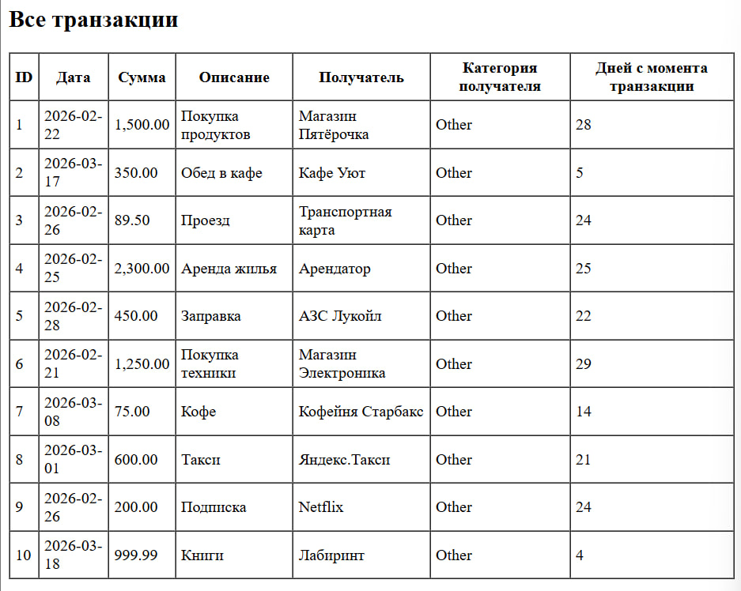
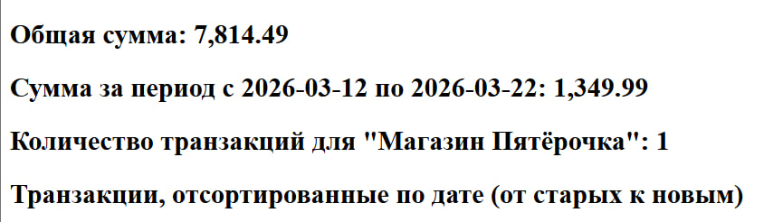
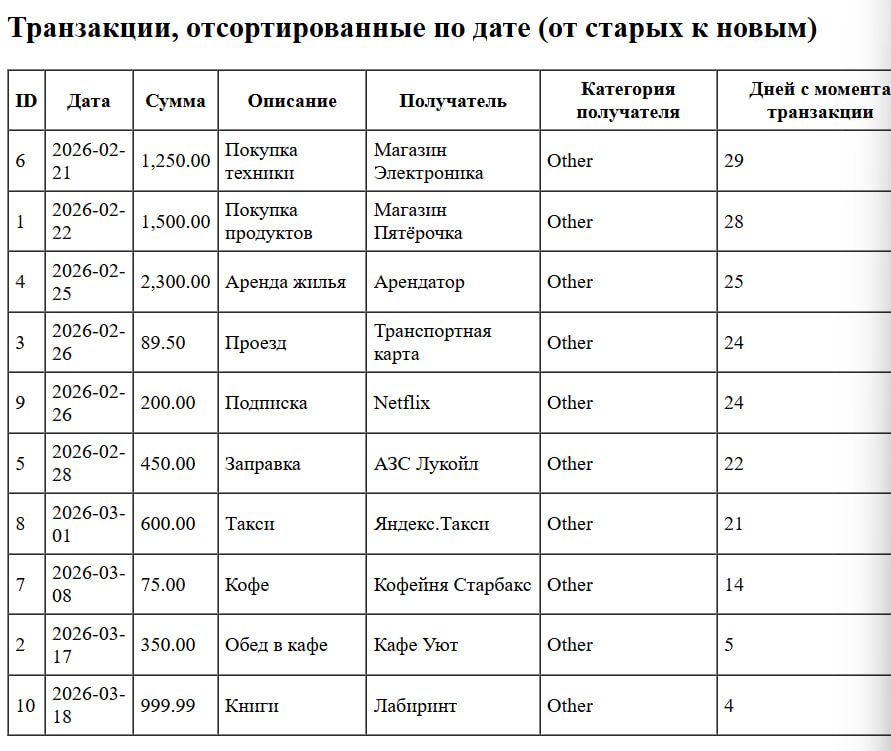
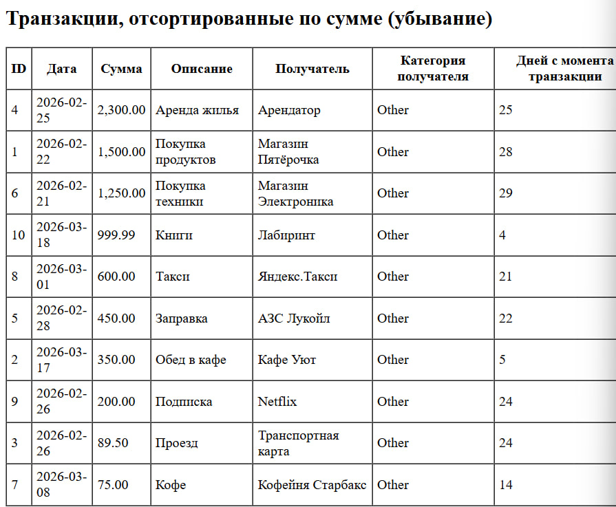
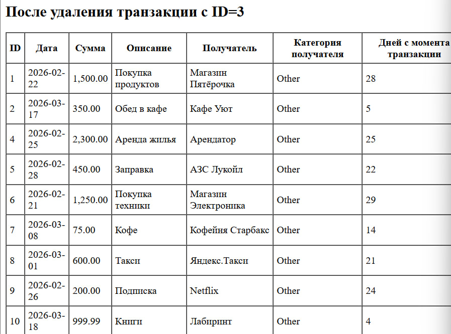

# Лабораторная работа №5. Объектно-ориентированное программирование в PHP.

## Цель работы.

Освоить основы объектно-ориентированного программирования в PHP на практике. Научиться создавать собственные классы, использовать инкапсуляцию для защиты данных, разделять ответственность между классами, а также применять интерфейсы для построения гибкой архитектуры приложения.

## Условие.

Необходимо разработать приложение для управления банковскими транзакциями.

Приложение должно позволять:

1. хранить банковские транзакции;
2. добавлять новые транзакции;
3. удалять транзакции;
4. искать транзакции;
5. сортировать транзакции;
6. выполнять вычисления над коллекцией транзакций;
7. выводить данные в виде HTML-таблицы.

## Практическая часть.

### Задание 1. Включаю строгую типизацию.

В начале каждого файла ввожу код, для того что бы включить строгую типизацию.

```php
<?php

declare(strict_types=1);
```

### Задание 2. Класс `Transaction`.

Создаю класс [Transaction](transaction.php), который описывает одну банковскую транзакцию.

Класс содержит следующие свойства:

* `id` - уникальный идентификатор.
* `date` - дата транзакций.
* `amount` - сумма транзакций.
* `description` - описание платежа.
* `merchant` - получатель платежа.

Так же содержит метод `getDaysSinceTransaction(): int` который возвращает колличество дней с момента транзакции до текущей даты.

### Задание 3. Класс `TransactionRepository`.

Создаю класс [TransactionRepository](transactionrepository.php), который будет управлять коллекцией транзакций. Этот класс отвечает только за хранение данных и базовые операции доступа к ним.

Класс выполняет:

* Хранит массив объектов Transaction.
* Добавляет новые транзакции. `addTransaction(Transaction $transaction): void`
* Удаляет транзакции по идентификатору. `removeTransactionById(int $id): void`
* Возвращает полный список транзакций. `getAllTransactions(): array`
* Находит транзакцию по id. `findById(int $id): ?Transaction`

### Задание 4. Класс `TransactionManager`.

Создаю класс [TransactionManager](transactionmanager.php), который  использует `TransactionRepository` для выполнения бизнес-логики.

Данный класс реализует:

* Вычисление общей суммы всех транзакций. `calculateTotalAmount(): float`
* Вычисление суммы транзакций за определенный период. `calculateTotalAmountByDateRange(string $startDate, string $endDate): float`
* Подсчет количества транзакций по определенному получателю. `countTransactionsByMerchant(string $merchant): int`
* Сортировку транзакций по дате. `sortTransactionsByDate(): Transaction[]`
* Сортировку транзакций по сумме по убыванию. `sortTransactionsByAmountDesc(): Transaction[]`

### Задание 5. Класс `TransactionTableRenderer`.

Создаю отдельный класс [TransactionTableRenderer](transactiontablerenderer.php), который отвечает только за вывод транзакций в HTML. Этот класс получает список транзакций и формирует HTML-таблицу.

Метод реализует:

* Принимает массив транзакций и возвращает строку с HTML-кодом таблицы. `render(array $transactions): string`

Метод возвращает таблицу со следующими столбцами.

* ID транзакции.
* Дата.
* Сумма.
* Описание.
* Название получателя.
* Категория получателя.
* Количество дней с момента транзакции.

### Задание 6. Начальные данные

Создаю 10 объектов `Transaction`. Каждая транзакция содержит:

* Разные даты.
* Разные суммы.
* Разные описания.
* Разных получателей.

### Задание 7. Интерфейс [TransactionStorageInterface](transactionstorageinterface.php).

Интерфейс должен содержать методы:

* Добавляет новую транзакцию в хранилище. `addTransaction(Transaction $transaction): void`
* Удаляет транзакцию из хранилища по ее уникальному идентификатору.`removeTransactionById(int $id): void`
* Возвращает все транзакции, которые в данный момент хранятся в репозитории. `getAllTransactions(): array`
* Выполняет поиск транзакции по ее уникальному идентификатору. `findById(int $id): ?Transaction`

Все классы и интерфейсы реализованы в соответствии с заданием. Главный исполняемый файл, объединяющий все компоненты и демонстрирующий работу приложения, доступен по ссылке:
<a href="index.php" target="_blank">index.php</a>

## Итог

После всей проблеланной работы, открыла в браузере файл index.php и вывело следующее:










## Контрольные вопросы.

1. Зачем нужна строгая типизация в PHP и как она помогает при разработке?

* Строгая типизация (declare(strict_types=1);) заставляет PHP проверять соответствие типов аргументов и возвращаемых значений. Это предотвращает скрытые ошибки, делает код более предсказуемым, улучшает самодокументирование и упрощает отладку.

2. Что такое класс в объектно-ориентированном программировании и какие основные компоненты класса вы знаете?

* Класс — это шаблон для создания объектов, объединяющий данные и поведение. Основные компоненты: свойства (поля), методы, конструктор (`__construct`), модификаторы доступа (`public`, `private`, `protected`).

3. Объясните, что такое полиморфизм и как он может быть реализован в PHP.

* Полиморфизм — способность объектов разных классов использовать один и тот же интерфейс (метод) по-разному. В PHP реализуется через наследование (переопределение методов) и интерфейсы (один интерфейс — разные реализации).

4. Что такое интерфейс в PHP и как он отличается от абстрактного класса?

* Интерфейс задаёт только сигнатуры методов (без реализации), не содержит свойств, и класс может реализовать несколько интерфейсов. Абстрактный класс может содержать реализованные методы и свойства, но класс может наследовать только один абстрактный класс.

5. Какие преимущества дает использование интерфейсов при проектировании архитектуры приложения? Объясните на примере данной лабораторной работы.

* Интерфейсы снижают связанность кода, упрощают тестирование и замену компонентов. В лабораторной работе `TransactionManager` зависит от `TransactionStorageInterface`, что позволяет легко заменить `TransactionRepository` на другую реализацию (например, для базы данных) без изменения кода менеджера.